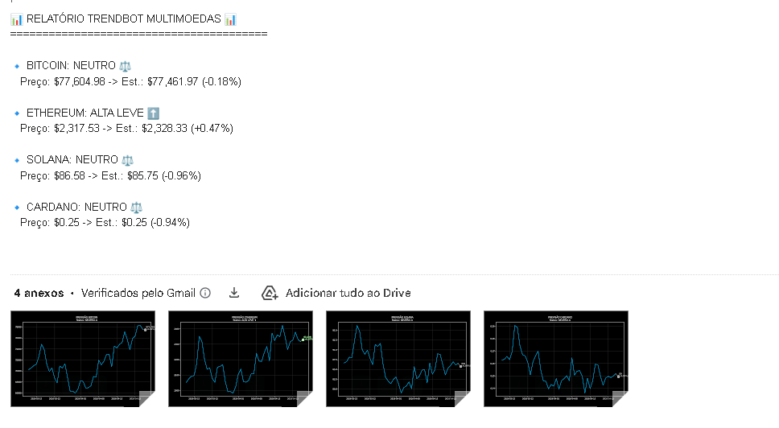
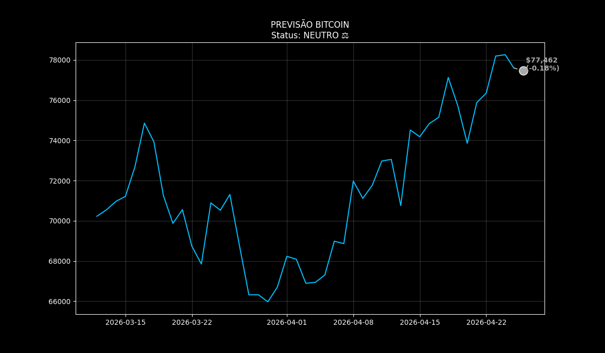
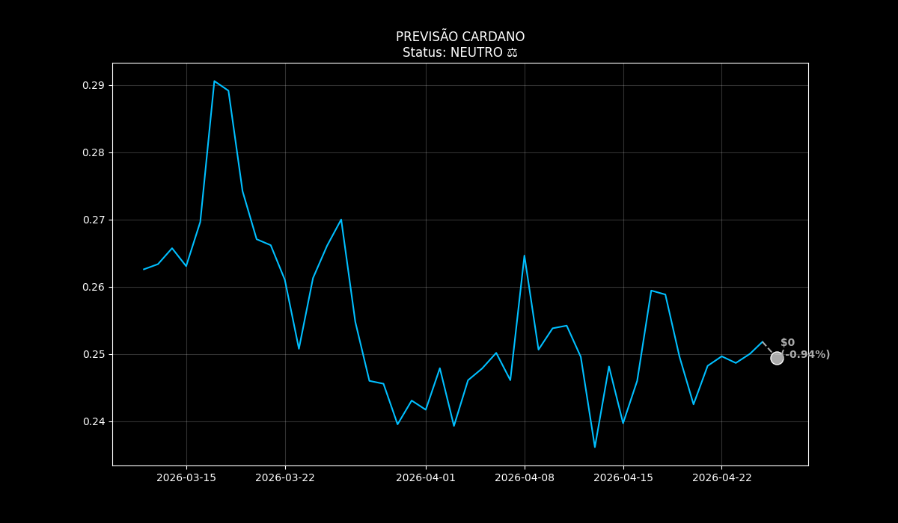
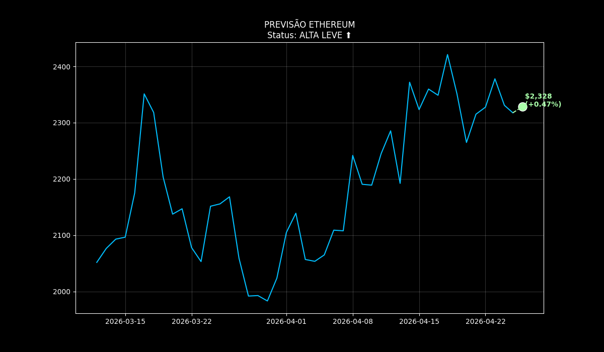
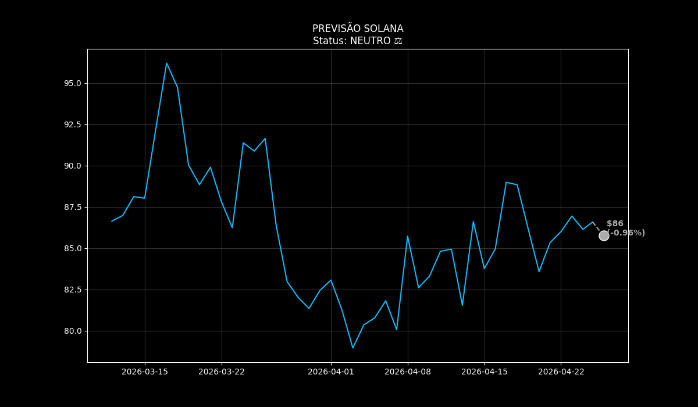

# TrendBot: Intelligent Multi-Asset Forecasting & Alert System

O TrendBot é um ecossistema de análise preditiva para o mercado de criptoativos que transforma dados brutos em inteligência acionável. Ele combina Engenharia de Dados, Machine Learning e Automação para entregar relatórios profissionais diretamente no e-mail do usuário.

Este projeto evoluiu do SAPA original para um motor multimoedas escalável, focado em alta disponibilidade e segurança de dados.
---

## Relatório Consolidado (E-mail)

O sistema agrupa as análises de todos os ativos configurados e envia um "Daily Digest" profissional.

Preview:

Bitcoin (BTC)

Cardano (ADA)

Ethereum (ETH)

Solana (SOL)

---

## 🎯 Funcionalidades Principais

| Módulo |Descrição | Ferramentas Chave|
|--------|----------|-----------|
| Módulo 1: Coleta| Puxa dados históricos em tempo real de APIs públicas (CoinGecko).| requests, pandas| 
| Módulo 2: Modelagem Preditiva| Treina um modelo de Séries Temporais para prever o preço do ativo nas próximas 24 horas.| Prophet (Meta/Facebook)| 
| Módulo 3: Visualização e Alerta| Gera um alerta condicional (Compra/Venda/Neutro) e cria um gráfico profissional (PNG) com a projeção.| matplotlib| 
|Módulo 4: Backtesting|Simula a aplicação da estratégia de alerta em dados históricos para provar o lucro teórico.|pandas (simulação customizada)|
|Módulo 5: Automação| Agendamento diário da execução do fluxo e entrega do alerta.schedule| 
| Módulo 6: Distribuição (Opcional)| Envio do alerta e do gráfico PNG para um canal/chat (ex: Telegram).| python-telegram-bot| 
---

## ⚙️ Instalação e Configuração

Pré-requisitos

- Python 3.8+

- Ambiente virtual (venv)

1. Clonar o Repositório e Configurar o Ambiente
   
```
git clone https://github.com/evertonldesouza/TrendBot.git
cd TrendBot
python -m venv venv
source venv/bin/activate  # Ou venv\Scripts\activate no Windows
```
2. Instalar Dependências

Este projeto requer bibliotecas de Data Science e Automação:
```
pip install -r requirements.txt
```


---

## ▶️ Como Rodar o Projeto
O projeto é projetado para rodar indefinidamente, executando o ciclo completo no horário agendado.

1. Execução (Modo Agendamento)
Mantenha o terminal aberto para que o schedule funcione. O sistema fará um teste inicial e entrará em modo de escuta.
```
python trendbot_engine.py
```
2. Teste e Configuração do Agendamento
Ajuste o horário no seu arquivo .env através da variável HORARIO_RODADA=10:00 para definir quando o alerta deve ser enviado todos os dias.
```
Python
# trendbot_engine.py (Final do arquivo)
HORARIO_RODADA = "10:00" # Ex: Alerta enviado diariamente às 10h da manhã
```

---

## 💡 Estratégia de Backtesting (Módulo 4)
O backtesting é executado automaticamente dentro do fluxo principal, simulando a seguinte regra de negociação:

- Sinal de Compra: O modelo Prophet prevê uma variação de preço acima de +1.0% no próximo dia.

- Sinal de Venda: O modelo Prophet prevê uma variação de preço abaixo de -1.0% no próximo dia.
  
O output do Backtesting é o Lucro Total Acumulado que o sistema teria gerado ao longo do período histórico analisado, validando a eficácia preditiva da sua solução.

## 📝 Estrutura do Projeto
```
TrendBot/
├── venv/                 # Ambiente Virtual
├── trendbot_coleta.py    # Módulo de Coleta de Dados API
├── trendbot_engine.py    # Módulos de ML, Alerta, Backtesting e Agendamento (principal)
├── alerta_*.png          # Arquivos de gráficos gerados
└── README.md             # Documentação do Projeto (este arquivo)
```
---

## 👨‍💻 Autor

**Everton Lima de Souza**

- LinkedIn: [@evertonldesouza](https://www.linkedin.com/in/evertonldesouza/)
- GitHub: [@evertonldesouza](https://github.com/evertonldesouza)
- Email: [evertonldesouza@proton.me]

## 📄 Licença

Este projeto está sob a licença MIT.

---

⭐ Se este projeto te ajudou, considere dar uma estrela!