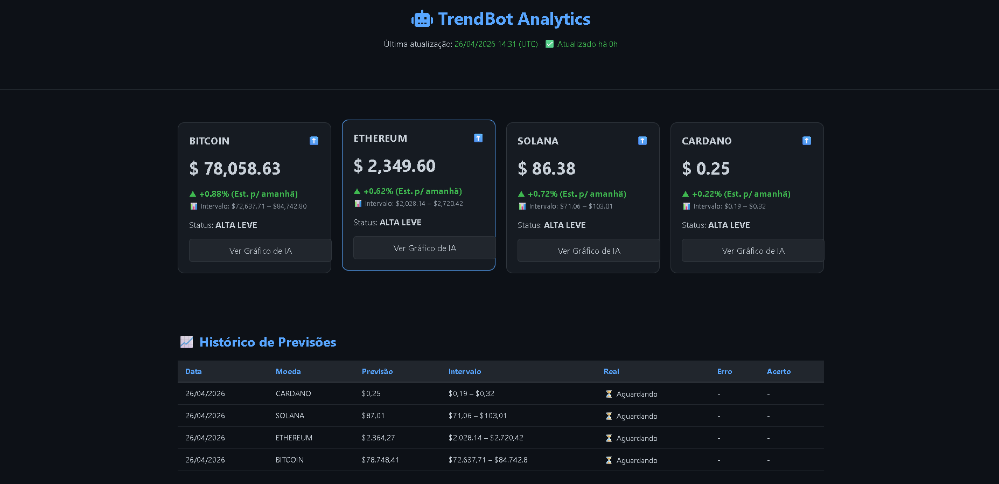

# TrendBot: Intelligent Multi-Asset Forecasting & Alert System

O TrendBot é um ecossistema de análise preditiva para o mercado de criptoativos que transforma dados brutos em inteligência acionável. Ele combina Engenharia de Dados, Machine Learning e Automação para entregar previsões diárias com validação histórica real.

 **[Acesse o Dashboard ao vivo](https://evertonldesouza.github.io/TrendBot/)**

---

## Dashboard

O sistema publica automaticamente um dashboard web atualizado diariamente com previsões, intervalos de confiança e histórico de acertos do modelo.



---

## Funcionalidades

| Módulo | Descrição | Ferramentas |
|--------|-----------|-------------|
| **Coleta** | Puxa dados históricos em tempo real via API pública (CoinGecko) | `requests`, `pandas` |
| **Modelagem Preditiva** | Treina um modelo de Séries Temporais para prever o preço nas próximas 24h com intervalo de confiança | `Prophet (Meta/Facebook)` |
| **Visualização** | Gera gráfico profissional (PNG) com histórico, previsão e status de alerta (Compra/Venda/Neutro) | `matplotlib` |
| **Dashboard Web** | Publica automaticamente cards com preço, previsão, variação e intervalo de confiança | `HTML`, `CSS`, `JavaScript` |
| **Histórico de Acertos** | Salva cada previsão e no dia seguinte compara com o preço real, calculando o erro e validando o modelo | `JSON` |
| **Relatório por E-mail** | Agrupa análises de todos os ativos e envia um Daily Digest profissional com os gráficos anexados | `smtplib` |
| **Automação CI/CD** | Execução diária automatizada via GitHub Actions com commit e push dos dados gerados | `GitHub Actions` |

---

## Como Funciona

```
CoinGecko API
     │
     ▼
Coleta de dados históricos (365 dias)
     │
     ▼
Modelo Prophet → Previsão D+1 + Intervalo de Confiança
     │
     ├──► Gráfico PNG (alerta visual)
     │
     ├──► data.json (dashboard web)
     │
     ├──► historico.json (validação de acertos)
     │
     └──► E-mail consolidado (Daily Digest)
```

O fluxo completo roda automaticamente todos os dias às **13:00 UTC** via GitHub Actions.

---

## Estratégia de Alertas

| Variação Prevista | Status | Sinal |
|-------------------|--------|-------|
| Acima de +1.0% | COMPRA FORTE | 🚀 |
| Entre 0% e +1.0% | ALTA LEVE | ⬆️ |
| Entre -1.0% e 0% | NEUTRO | ⚖️ |
| Abaixo de -1.0% | VENDA | 🚨 |

---

## Validação do Modelo (Histórico de Acertos)

A cada execução, o bot:

1. Busca a previsão feita ontem para cada ativo
2. Compara com o preço real de hoje
3. Marca como ✅ se o erro for menor que 2% ou ❌ caso contrário
4. Registra tudo no `historico.json`, exibido na tabela do dashboard

Isso prova empiricamente a eficácia do modelo ao longo do tempo.

---

## Instalação e Configuração

**Pré-requisitos**
- Python 3.8+
- Conta Gmail com senha de app habilitada

**1. Clonar e configurar o ambiente**

```bash
git clone https://github.com/evertonldesouza/TrendBot.git
cd TrendBot
python -m venv venv
source venv/bin/activate  # Windows: venv\Scripts\activate
pip install -r requirements.txt
```

**2. Criar o arquivo `.env`**

```env
EMAIL_REMETENTE=seu@gmail.com
EMAIL_SENHA=sua_senha_de_app
EMAIL_DESTINO=destino@gmail.com
MOEDAS_ALVO=bitcoin,ethereum,solana,cardano
DIAS_HISTORICO=365
```

**3. Rodar localmente**

```bash
python trendbot_engine.py
```

O sistema executa o ciclo completo uma vez e entra em modo de agendamento para rodar diariamente no horário configurado.

---

## Automação com GitHub Actions

O arquivo `.github/workflows/daily_report.yml` configura a execução automática diária.

**Secrets necessários no repositório:**

| Secret | Descrição |
|--------|-----------|
| `EMAIL_REMETENTE` | Endereço Gmail de envio |
| `EMAIL_SENHA` | Senha de app do Gmail |
| `EMAIL_DESTINO` | Endereço de destino do relatório |

Configure em: `Settings → Secrets and variables → Actions`

---

## Estrutura do Projeto

```
TrendBot/
├── .github/
│   └── workflows/
│       └── daily_report.yml   # Automação CI/CD
├── docs/                      # Dashboard Web (GitHub Pages)
│   ├── index.html
│   ├── style.css
│   ├── script.js
│   ├── data.json              # Dados atuais (gerado pelo bot)
│   ├── historico.json         # Histórico de previsões (gerado pelo bot)
│   └── alerta_*.png           # Gráficos gerados pelo bot
├── trendbot_coleta.py         # Módulo de coleta via API
├── trendbot_engine.py         # Motor principal (ML, alertas, e-mail)
├── requirements.txt
└── README.md
```

---

## Autor

**Everton Lima de Souza**

[](https://www.linkedin.com/in/evertonldesouza/)
[](https://github.com/evertonldesouza)
[](mailto:evertonldesouza@proton.me)

---

## Licença

Este projeto está sob a licença MIT.

---

⭐ Se este projeto te ajudou, considere dar uma estrela!